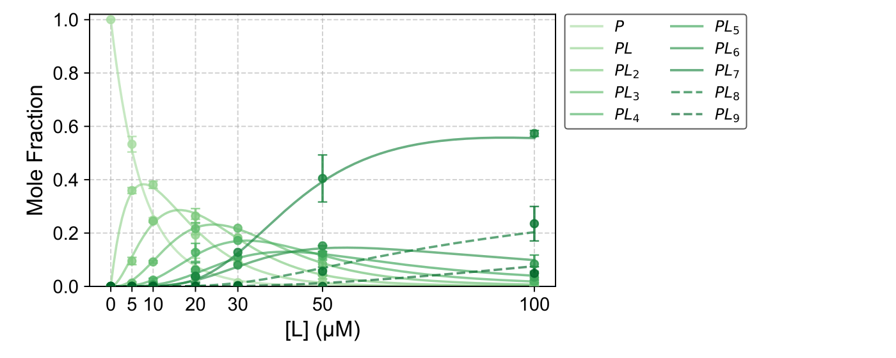

# Protein Ligand Binding Models

Fit native-MS protein-ligand bound-state fractions with sequential specific and nonspecific-adduct models. The Python import is `scripts_binding`.

## Run the real-data example

Python 3.10 or newer is required. From the repository root:

```bash
python -m venv .venv
# Linux/macOS: source .venv/bin/activate
# Windows PowerShell: .venv\Scripts\Activate.ps1
python -m pip install -e .
python run.py
```

In Windows VS Code, open the repository folder, select the `.venv` Python interpreter, open `run.py`, and click **Run Python File**. It runs the ADP/AmAc example by default. To choose a different YAML for that button, edit just the `YAML_FILE = "examples/adp_amac_20c/fit.yaml"` line in `run.py`. Paths are relative to the repository root.

| Path setting | Relative to |
|---|---|
| `YAML_FILE` in `run.py` | Repository root |
| `base_dir`, `data_path`, `deconv_csv_path` in YAML | YAML file's directory |
| `wildcard_fmt`, `out_fmt` in YAML | Resolved `base_dir` |

Absolute paths are accepted for `YAML_FILE`, `base_dir`, `data_path`, and `deconv_csv_path`. Use forward slashes in both `run.py` and YAML on Windows, such as `C:/data/titration.csv`; they avoid backslash escapes in quoted strings.

The example fits three ADP/AmAc native-MS replicates at 20 °C. Input CSVs, configuration, provenance, and the expected graphic are together in [examples/adp_amac_20c](examples/adp_amac_20c/README.md). The command writes per-replicate fit SVGs and fitted-constant CSVs, plus a combined figure with observed replicate error bars, a summary CSV, and an optimizer log under `examples/adp_amac_20c/output/`.



The preview combines the three independent fits. Error bars show sample SD of measured replicates where at least two are available. The 30 µM point has one replicate and no error bar. This figure is not a claim that the model uniquely identifies binding sites or mechanisms.

## Other example

[examples/synthetic](examples/synthetic/README.md) shows a two-site fitting check and forward simulation from supplied constants. See the [example index](examples/README.md) for both commands.

## Input and output

Titration CSVs use `Entry` for total ligand concentration and `I0`, `I1`, etc. for bound-state intensities or fractions. Set ligand units and protein concentration in YAML. Missing intensity cells remain missing; measured zeros remain zero. Inputs accept UTF-8, UTF-8 BOM, UTF-16 BOM, and Windows-1252. Output CSVs use UTF-8 with comma separators and decimal points.

Model families: sequential specific, sequential adduct, competing adduct, stochastic adduct, occupancy decay, and shared-site. Thermodynamic analysis code is included for temperature series. Check fit quality and parameter identifiability before biological interpretation.

### Choose a site count

Use the generic `sequential_specific` model for a new system. Set `s` to its proposed number of specific binding steps and `s_mode: manual` to fit that count. With `s_mode: auto`, the specific-only model uses the highest observed bound-state index; adduct models scan site counts by BIC. In manual mode, adduct models use `s` and infer additional slots from the CSV width unless `n_override` is set. Example:

```yaml
defaults:
  models: [sequential_specific]
  s: 5
  s_mode: manual
```

### Plot colors

Set these YAML keys to Matplotlib colormap names such as `viridis`, `Greens`, or `Purples`:

| Key | Plot elements |
|---|---|
| `colormap` | All apparent bound-state curves; default for deconvolution components |
| `specific_colormap` | Specific-only model curves and pure-specific deconvolution components |
| `nonspecific_colormap` | Deconvolution components containing nonspecific binding |

The default is `colormap: PRGn`; the AmAc example explicitly uses `Greens`. To use one map for everything, set only `colormap`. To use separate component maps, enable `deconv_enable: true` and set the two optional keys. Apparent peaks in adduct models can contain both binding types, so their fit curves use the overall `colormap`.

## Build

```bash
python -m pip install build
python -m build
```

## License

BSD 3-Clause. See [LICENSE](LICENSE).
