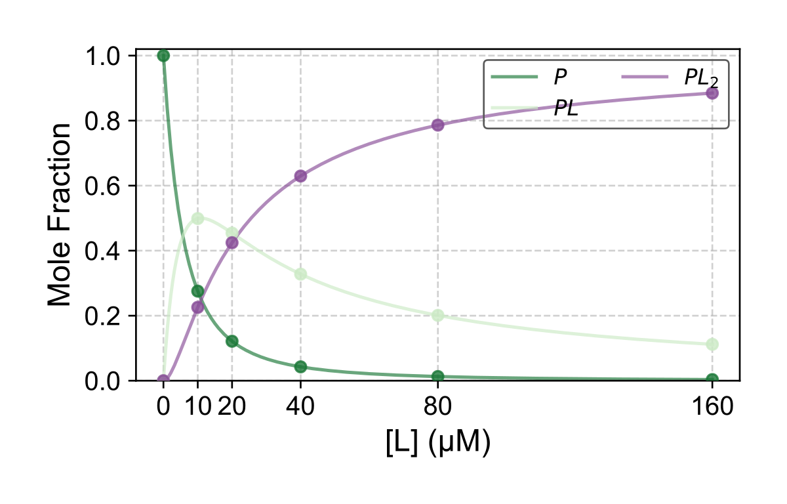

# Synthetic two-site example

## Run

From the repository root after installation:

```bash
python run.py examples/synthetic/fit.yaml
```



To generate bound-state curves from the supplied constants:

```bash
protein-ligand-simulate --params examples/synthetic/parameters.csv --out-dir examples/synthetic/simulation --p-tot 1 --p-tot-unit uM --ligand-max 160 --ligand-unit uM --csv
```

## Inputs and expected result

| File | Purpose |
|---|---|
| `fit.yaml` | Protein concentration, units, model, and output path |
| `titration.csv` | Six ligand concentrations with three bound states |
| `parameters.csv` | Forward simulation example |

The parameter CSV uses `label,model,param,value,unit,is_kd`. Each label has `S` and `N` rows plus the model's named parameters. Set `is_kd` to `1` for a dissociation constant in the stated unit or `0` for an association constant in inverse molar units.

`fit.yaml` lists every setting used by the fitting runner, with brief inline comments. Edit it and run `python run.py examples/synthetic/fit.yaml` again; paths are relative to the YAML, so the command works from another working directory too.

The synthetic titration uses a two-site sequential-specific model with 5 and 20 micromolar dissociation constants. Check the generated fitted-constant CSV, fit SVG, and optimization log under `output_demo/sequential_specific/` for recovery and fit diagnostics.

Data flow: CSV intensities → row fractions → free-ligand mass balance → model fit → fitted constants and diagnostics.
